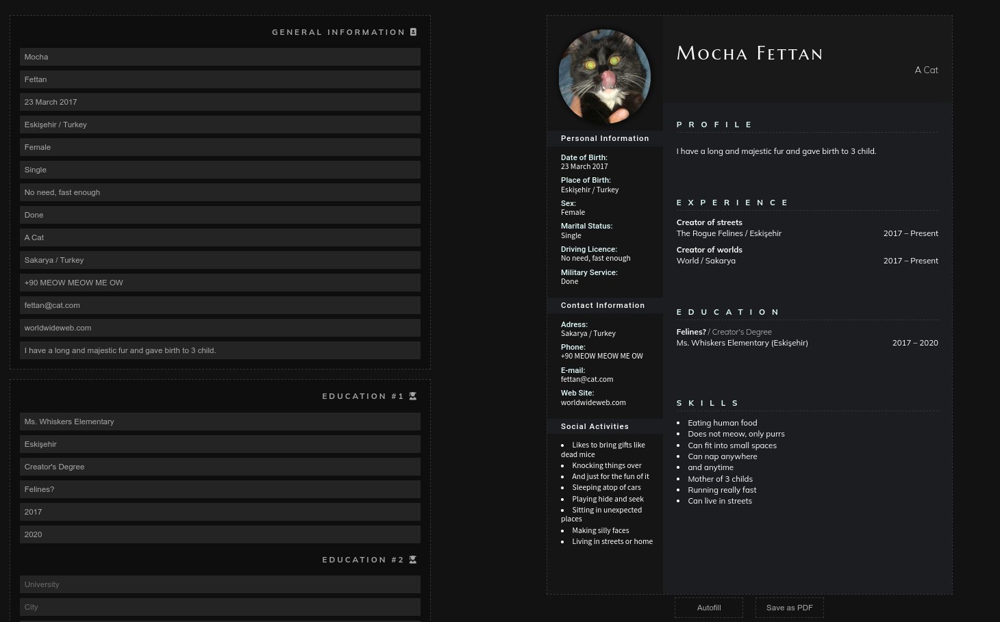

# CV Generator App

A React app which allows users to create their own resume and download it in a PDF format.

Created with **React**.

⮕ [Live preview](https://fatiharapoglu.github.io/cv-generator/)

## Features

-   English and Turkish language support.
-   Light and Dark color themes.
-   Autofill button for filling examples for user to see how it looks.
-   Avatar image upload support.
-   Save the resume as PDF.

## Helper Dependencies

-   [jsPDF](https://github.com/parallax/jsPDF/) for generating PDFs
-   [html2canvas](https://html2canvas.hertzen.com/) for taking screenshots of the page
-   [FontAwesome](https://fontawesome.com/) Icons
-   [Eslint](https://eslint.org/) for linting
-   [Prettier](https://prettier.io/) for formatting

## Roadmap

-   Make design responsive.

## How It Looks

